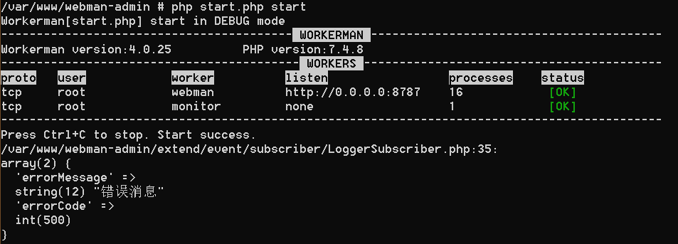

# webman-event

[]()
[]()
[]()
[]()
[]()
[]()

事件相比较中间件的优势是事件比中间件更加精准定位（或者说粒度更细），并且更适合一些业务场景的扩展。例如，我们通常会遇到用户注册或者登录后需要做一系列操作，通过事件系统可以做到不侵入原有代码完成登录的操作扩展，降低系统的耦合性的同时，也降低了BUG的可能性。

## 安装

```shell script
composer require tinywan/event
```

## 快速开始

### 监听事件

事件类 `LogErrorWriteEvent.php`

```php
namespace extend;

use Symfony\Contracts\EventDispatcher\Event;

class LogErrorWriteEvent extends Event
{
    const NAME = 'log.error.write';  // 事件名，事件的唯一标识

    public $log;

    public function __construct(array $log)
    {
        $this->log = $log;
    }

    public function handle()
    {
        return $this->log;
    }
}
```

事件监听

```php
return [
    // 事件监听
    'listener'    => [
        \extend\LogErrorWriteEvent::NAME => \extend\LogErrorWriteEvent::class,
        \extend\DingTalkEvent::NAME => \extend\DingTalkEvent::class,
    ],
];
```

### 事件订阅

订阅类 `LoggerSubscriber.php`

```php
namespace extend;


use Symfony\Component\EventDispatcher\EventSubscriberInterface;
use Symfony\Contracts\EventDispatcher\Event;

class LoggerSubscriber implements EventSubscriberInterface
{
    public static function getSubscribedEvents(): array
    {
        // 监听的不同事件，当事件触发时，会调用 onResponse 方法
        return [
            \extend\LogErrorWriteEvent::NAME => 'onResponse',
            \extend\DingTalkEvent::NAME => 'onResponse',
        ];
    }

    /**
     * @desc: 触发事件
     * @param Event $event
     */
    public function onResponse(Event $event)
    {
        // 一些具体的业务逻辑
        var_dump($event->handle());
    }
}
```

事件订阅
```php
return [
    // 事件订阅
    'subscriber' => [
         \extend\LoggerSubscriber::class
    ],
];
```

### 事件触发器

触发 `LogErrorWriteEvent` 事件。

```php
$error = [
    'errorMessage' => '错误消息',
    'errorCode' => 500
];
Tinywan\Event::trigger(new \extend\LogErrorWriteEvent($error), \extend\LogErrorWriteEvent::NAME);
```

### 助手函数（推荐）

```php
$error = [
    'errorMessage' => '错误消息',
    'errorCode' => 500
];
event(new \extend\LogErrorWriteEvent($error), \extend\LogErrorWriteEvent::NAME);
```

执行结果



## License

This project is licensed under the [Apache 2.0 license](LICENSE).
